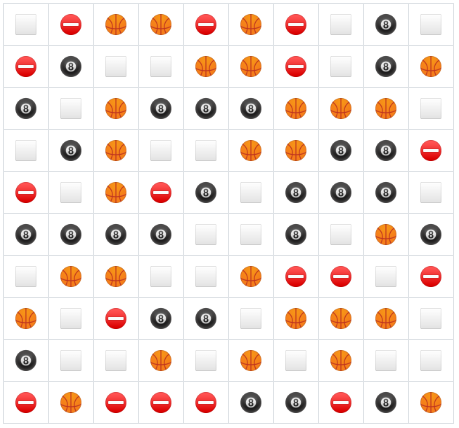

# Line 'Em Up

<center></center>

## Intro

Line 'Em Up is Tic Tac Toe reinvented. This new game adds dynamic board sizes and solve lengths, and a new "blocked" tile. This makes for a fun and unique AI challenge! The game concept was proposed by [Dr. Leila Kosseim](https://users.encs.concordia.ca/~kosseim/) for the COMP 472 class at Concordia.

## Getting Started

All executable require the same base dependencies. To prevent polluting global python libraries, you should install these dependencies inside a virtual environment. The easiest way to do so with vanilla Python is:

```bash
python3 -m .venv ./venv
source ./.venv/bin/activate...
pip3 install -r requirements.txt
```

Before running anything, make sure to create your local `.env` file with the sample that can be found below.

### Client

To run a client, you must have a server instance running. This can be a publically hosted version or locally hosted version. On the server, you must start a game. Note the `game_uuid`, which can be found in the URL or in the `Join` page.

To run a human client:

```
python3 main.py client human --id PLAYER_UUID --game GAME_UUID
```

Once confirmed working, you can implement the actual AI. This can be done by modifying the contents of `/line_em_up/ai` (other folders should remain untouched - please make an issue if you want changes!). 

To test/run your AI implementation:

```
python3 main.py client ai --id PLAYER_UUID --game GAME_UUID
```

If you want your AI to run against itself or have multiple AIs in parallel, you can simply start new instances and specify the `game_uuid` you want to play on.

### Server

To run the server:

```
python3 main.py server
```

You can find the server running at http://localhost:5000/.

## Sample Dotenv

Add these configs to your local `.env` file.

```
# Client
URL=http://localhost:5000/

# Server
```